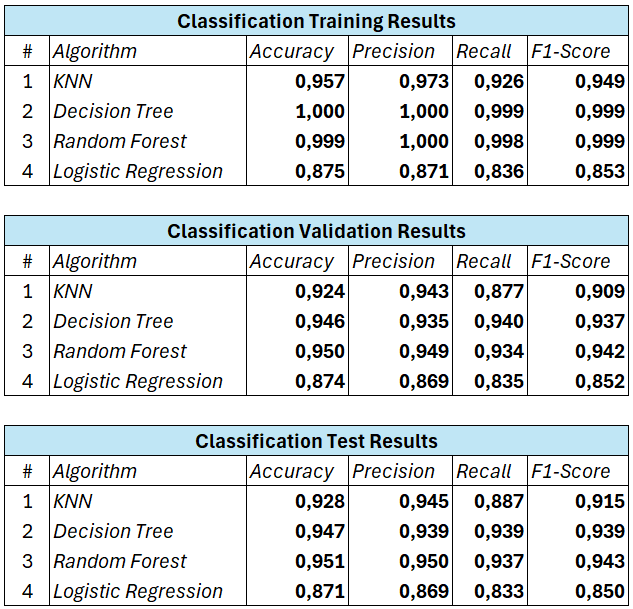
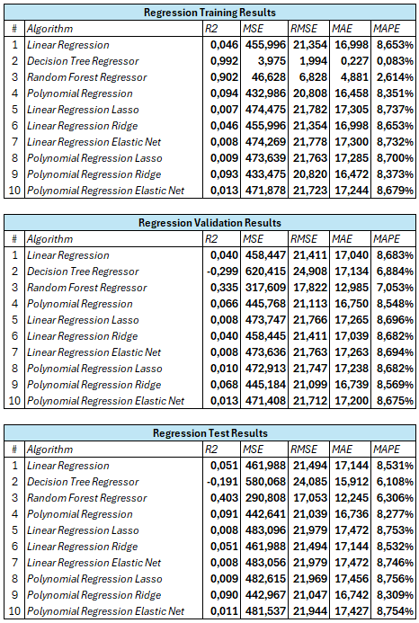
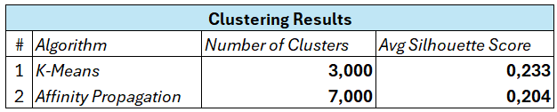

# Machine Learning Essay
## 1.0 Descrição e Objetivo
Projeto proposto na disciplina de "Fundamentos de Machine Learning" da Comunidade DS.

Seu principal objetivo é realizar um ensaio de Machine Learning utilizando diversos algoritmos de Classificação, Regressão e Clusterização. 
Nesse ensaio, é preciso avaliar as métricas de performance e controle de parâmetros em conjuntos de dados pré definidos.

## 2.0 Desenvolvimento da Solução
### 2.1 O Problema Apresentado
Dada a quantidade de algoritmos disponíveis, realizar ensaios periódicos ajuda a adiquirir cada vez mais experiência sobre funcionamento e performance.
A principal tarefa desse projeto é realizar três ensaios: Classificação, Regressão e Clusterização a fim de avaliar as métricas de performance e compara-las

### 2.2 Algoritmos e Métricas do ensaio
#### 2.2.1 Classificação
**Algoritmos**: KNN, Decision Tree, Random Forest e Logistic Regression

**Métricas de Performance**: Accuracy, Precision, Recall e F1-Score

#### 2.2.2 Regressão
**Algoritmos**: Linear Regression, Decision Tree Regressor, Random Forest Regressor, Polinomial
Regression, Linear Regression Lasso, Linear Regression Ridge, Linear Regression Elastic Net,
Polinomial Regression Lasso, Polinomial Regression Ridge e Polinomial Regression Elastic Net

**Métricas de Performance**: R2, MSE, RMSE, MAE e MAPE

#### 2.2.3 Clusterização
**Algoritmos**: K-Means e Affinity Propagation

**Métricas de Performance**: Silhouette Score

### 2.3 Ferramentas Utilizadas
Python 3.10 e Scikit-learn

### 2.4 Passo a Passo
#### 2.4.1 Algoritmos de Classificação e Regressão
1. Divisão dos datasets em treino, validação e teste;
2. Treinamento usando os dados de treino e parâmetros "default";
3. Medição das métricas de performance do treino de acordo com cada ensaio;
4. Medição das métricas de performance de cada ensaio usando dados de validação;
5. Ajuste dos parâmetros pré definidos durante a apresentação do problema para encontrar a melhor performance;
6. União dos dados de treinamento e validação;
7. Retreino do algoritmo utilizando os melhores parâmetros;
8. Treino e medição final utilizando os dados de teste;
9. Preenchimento das tabelas de resultados.

#### 2.4.2 Algoritmos de Clusterização
1. Carregamento do dataset;
2. Definição do algoritmo e ajustes dos parâmetros;
3. Escolha do melhor número de Clusters;
4. Medição de "Silhouette Score";
5. Preenchimento da tabela de resultados.

## 3.0 Resultados
### 3.1 Classification Essay

### 3.2 Regression Essay

### 3.3 Clustering Essay

## 4.0 Conclusão
Esse foi meu primeiro contato com algoritmos de Machine Learning. 
Ao fazer o ensaio, pude perceber que existem diversos algoritmos diferentes, cada um com sua especificidade.

Pude trabalhar com os principais algoritmos, variando seus parâmetros e testando sua performance em diferentes contextos.

Além disso, consegui entender mais sobre as limitações de cada algoritmo, overfitting, underfitting, sensibilidade a outliers e comportamento no geral.

## 5.0 Top 3 Insights
### 5.1 Insight 1
É importante compreender o problema de negócio, para que assim seja possível escolher quais os melhores algoritmos para cada situação.

### 5.2 Insight 2
Calibrar os parâmetros e validar o treinamento utilizando as métricas de performance corretas, precisa ser feito com total cuidado e atenção. 
Encontrar equilíbrio entre viés e variância, pois o algoritmo precisa ser complexo o suficiente para entender o comportamento e generalizar, mas não tão pode ser complexo a ponto de "decorar" os dados.

### 5.3 Insight 3
No caso do ensaio de Clusterização, os resultados não apresentaram boas métricas de performance, isso demonstra a necessidade de investigar melhor os atributos e coleta dos dados.

## 6.0 Próximos Passos
- Aprofundar os conhecimentos nos algoritmos estudados;
- Conhecer, estudar e ensaiar novos algoritmos;
- Refazer os ensaios incrementando o número de algoritmos, testando novos parâmetros e métricas;
- Aplicar o que foi estudado no dia a dia.